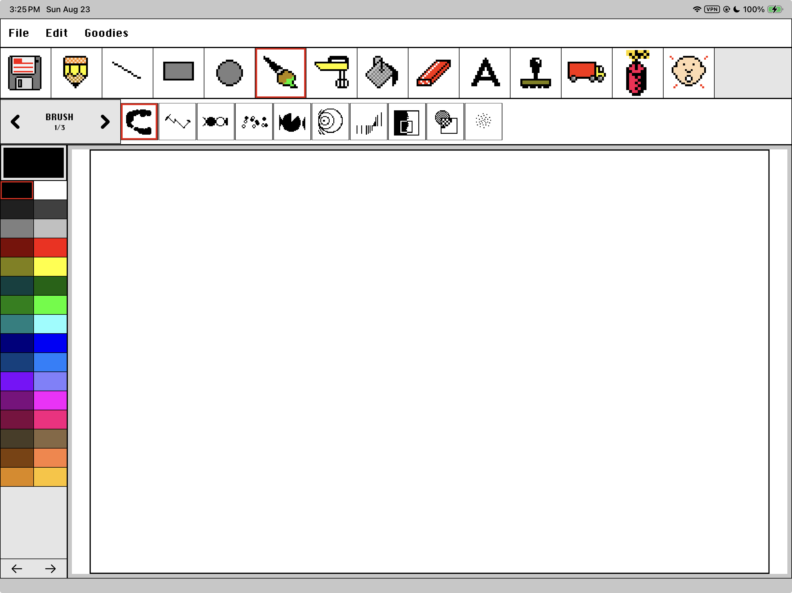

# KidPad

<p align="center">
  <strong>Kid Pix, native on iPad.</strong><br>
  An unofficial recreation of Kid Pix 1.0, rebuilt in Swift for Apple Pencil, touch, sound, and modern documents.
</p>

<p align="center">
  
  
  
  
  
  
</p>



KidPad is a native recreation of the classic Kid Pix experience for iPad and Mac. It aims to look, sound, and behave like Kid Pix, using the familiar artwork, sounds, tools, menus, stamps, brushes, and playful interactions available through the pinned [JSKidPix](https://github.com/vikrum/kidpix) project.

The experience is deliberately recognizable. This is not a loosely inspired drawing app with a retro skin. KidPad's purpose is to make Kid Pix feel at home on a modern iPad.

> **In one sentence:** KidPad is Kid Pix for iPad, recreated natively and released as an independent, unofficial project.

## What KidPad is

- A new native Swift implementation of the Kid Pix drawing experience.
- A Core Graphics canvas with SwiftUI and UIKit controls, not a browser canvas.
- An iPad-first app with Apple Pencil pressure, touch input, two-finger zoom and pan, autosave, recent drawings, and PNG export.
- A recreation that uses the classic artwork and sounds downloaded from a pinned JSKidPix revision after the user approves the download.
- A project that also runs on macOS through Mac Catalyst.

## What KidPad is not

- It is not an official Kid Pix release, update, or product from Software MacKiev.
- It is not built from the original commercial Kid Pix source code.
- It is not an emulator, virtual machine, or old Macintosh application.
- It is not a wrapper around the JSKidPix website.
- It does not bundle the Classic Pack inside the public repository or IPA.
- It does not claim that the KID PIX trademark or every historical asset has been independently cleared by this project.

## How it was made

KidPad uses the pinned [`vikrum/kidpix@99c67f3`](https://github.com/vikrum/kidpix/tree/99c67f3427d229f7db60b03dcf19df4d8c2a8ecf) project as its behavior and asset reference.

JSKidPix is itself a hand-built HTML and JavaScript reimplementation of Kid Pix,
not a publication or translation of the original Macintosh source. Its public
issue history documents a combination of controlled observation, comparison,
targeted reverse engineering of the 1989 executable, explanations from Craig
Hickman, and established open-source graphics algorithms. KidPad begins from
that public reference and rebuilds the experience again for native Apple
platforms.

1. **The tools were studied.** KidPad follows the tool catalogs, menus, brush choices, sounds, and visible behavior exposed by that exact JSKidPix revision.
2. **The drawing engine was rebuilt.** Pencil, shapes, Wacky Brush, Electric Mixer, Fill, Eraser, Alphabet, Rubber Stamps, Moving Van, Undo, documents, and input handling were implemented as native Swift code.
3. **The interface was adapted for iPad.** The classic workspace was preserved while adding Apple Pencil pressure, responsive layouts, left-handed mode, touch-sized controls, and two-finger canvas navigation.
4. **The classic presentation was restored.** After installation, the app can use the familiar PNG and WAV resources from the pinned JSKidPix Classic Pack.
5. **The public build was separated from the pack.** Release builds contain the native app and a separately licensed font, while the optional Classic Pack is obtained only after the user chooses to download it.

The result is a native recreation, not a mechanical conversion of JavaScript and not an emulated copy of the old application. KidPad Version 1 did not use the original Kid Pix source code or translate its compiled 68K executable. Some complex effects therefore remain native approximations; [`docs/PARITY_MATRIX.md`](docs/PARITY_MATRIX.md) records those differences.

The complete development lineage, archival investigation, AI-assisted
engineering process, reused-media boundary, and remaining unknowns are recorded
in [`docs/HISTORICAL_PROVENANCE.md`](docs/HISTORICAL_PROVENANCE.md).

## How the Classic Pack works

KidPad's public source tree and IPA do not contain the classic artwork or sounds.

On first launch:

1. KidPad explains what the Classic Pack contains and where it comes from.
2. The user chooses whether to download it.
3. KidPad fetches 228 PNG and WAV data files directly from the immutable JSKidPix commit above.
4. The app verifies the complete file catalog and whole-pack SHA-256 digest.
5. Only a complete, verified pack is installed in the app's private Application Support directory.
6. The native workspace opens and uses those resources for its interface, stamps, brushes, and sounds.

No JavaScript or executable code is downloaded or run. If the download is refused, interrupted, or fails verification, the pack is not installed.

## Rights basis and remaining uncertainty

This section explains the project's distribution basis. It is not legal advice or a guarantee of clearance.

### Native KidPad code

KidPad's Swift, SwiftUI, UIKit, Core Graphics, tests, build scripts, and documentation are original project code released under the [Apache License 2.0](LICENSE).

### JSKidPix and the Classic Pack

The upstream JSKidPix repository:

- is published under the [GNU General Public License v3.0](https://github.com/vikrum/kidpix/blob/99c67f3427d229f7db60b03dcf19df4d8c2a8ecf/LICENSE);
- publicly provides the PNG and WAV files used by the Classic Pack; and
- states in its README that the original 1989 Kid Pix 1.0 was released into the public domain.

KidPad relies on that upstream publication, license, and statement as the basis for obtaining the pack. It pins one immutable commit, sends users to the upstream source and license, requires an affirmative download choice, and does not redistribute the pack inside the KidPad repository or application binary.

That structure makes the source of every downloaded file explicit, but it does not independently prove that every historical image, sound, logo, or other underlying work is in the public domain or was separately cleared by the upstream publisher. Public availability alone is not proof of ownership. The detailed boundary is documented in [`RIGHTS_AND_LICENSES.md`](RIGHTS_AND_LICENSES.md), [`NOTICE`](NOTICE), and [`AssetLedger.json`](AssetLedger.json).

### Name and trademark

[Software MacKiev identifies KID PIX as its registered trademark](https://www.natura.kidpix.com/techsupport/winkidpix/support.html?ext=yes). KidPad uses the words “Kid Pix” to identify the experience being recreated, but KidPad is a separate product name and this project is not affiliated with, endorsed by, sponsored by, or licensed by Software MacKiev or any other Kid Pix rights holder.

In practical terms: this is intended to be Kid Pix on iPad, but it is not an official Kid Pix release.

## Version 1 status

| Distribution path | Status |
| --- | --- |
| Build from source with Xcode | Available |
| Run on iPad and Mac Catalyst | Available |
| Create a local unsigned IPA | Available through `Scripts/package_public_ipa.sh` |
| Download a hosted IPA | Not published yet |
| App Store or TestFlight | Not announced |

Version 1 was accepted on an iPad Pro 12.9-inch (6th generation) after a clean AltStore installation. First-run Classic Pack setup, Apple Pencil drawing, pressure response, and the lower-latency brush pipeline were exercised on hardware. Tilt, hover, double-tap, squeeze, roll, and the complete palm-rejection matrix remain targeted checks rather than completed claims.

## What works

| Area | Current result |
| --- | --- |
| Canvas | Native 1920 x 1200 raster document with an 8:5 letterboxed presentation |
| Drawing | Pencil, line, rectangle, oval, Wacky Brush, fill, eraser, Undo, and Redo |
| Apple Pencil | Coalesced input, predicted-stroke feedback, and pressure-sensitive width |
| Creative tools | Electric Mixer, TNT, Alphabet, Rubber Stamps, and Moving Van |
| Workspace | File, Edit, and Goodies menus with click-away dismissal |
| Layout | Portrait, landscape, compact-width, and left-handed toolbar layouts |
| Documents | Autosave, backup recovery, thumbnails, Save, and PNG export |
| Audio | Goodies mute control and bounded sound playback |
| Platforms | iPadOS 17 or later and macOS through Mac Catalyst |

## Build and run

Requirements:

- macOS with Xcode
- an iPad Simulator runtime, or an iPad with your own signing setup
- iPadOS 17 or later for the iPad target

```bash
git clone https://github.com/chrissotraidis/kidpad.git
cd kidpad
Scripts/build_public.sh
```

The script builds `ReleasePublic` in isolated derived data and scans the resulting app bundle for excluded research assets. To run from Xcode, open `KidPad.xcodeproj`, select the `KidPad` scheme, choose an iPad Simulator or connected iPad, and press Run.

For Mac, select **My Mac (Mac Catalyst)** and build `ReleasePublic`. A raw iOS `.app` cannot be copied into `/Applications`; Mac Catalyst produces the correct macOS executable format.

See [`docs/BUILDING.md`](docs/BUILDING.md) for clean-machine steps, tests, signing notes, and the local packaging workflow.

## Create a local unsigned IPA

```bash
Scripts/package_public_ipa.sh
```

This creates `build/releases/KidPad-unsigned.ipa` and a SHA-256 checksum. The unsigned IPA must be signed for the destination device by Xcode, AltStore, or another signing service. It contains no Classic Pack and prompts for the optional download after installation.

KidPad does not currently publish a prebuilt IPA from this repository. That artifact can be added separately without changing the source or Classic Pack boundary.

## Frequently asked questions

### Is this actually Kid Pix on iPad?

That is the goal and the intended experience. KidPad recreates the recognizable Kid Pix workspace, tools, artwork, and sounds as a native iPad app. It is unofficial and independently developed.

### How was KidPad made?

KidPad's application, canvas, documents, touch input, Apple Pencil support, and
audio playback were implemented as native Swift code using SwiftUI, UIKit, and
Core Graphics. The pinned JSKidPix revision supplied the behavior catalog,
option ordering, visual reference, sound mapping, and optional Classic Pack.
The shipping app does not run JavaScript or emulate a Macintosh.

Development used AI-assisted software engineering for implementation, testing,
research, debugging, and documentation. AI did not supply or recover original
Kid Pix source code. Project direction, physical-device testing, and release
acceptance were performed by the maintainer.

### What is KidPad derived from?

- Native application code: new KidPad Swift code.
- Tool behavior and presentation: studied from pinned JSKidPix.
- Classic artwork and sounds: downloaded from that pinned JSKidPix revision
  only after user consent.
- Original Kid Pix source code: not obtained or used.
- Original Macintosh executable: not bundled, translated, or executed.

See [`docs/HISTORICAL_PROVENANCE.md`](docs/HISTORICAL_PROVENANCE.md) for the
source-backed history and explicit unknowns.

### Does it use the classic Kid Pix artwork and sounds?

Yes. After the user agrees, KidPad downloads the pinned Classic Pack directly from JSKidPix and verifies it before use. Those files are not stored in this repository or bundled in the IPA.

### Is it running the JSKidPix website?

No. The product canvas and tools are native Swift code. An optional local web reference exists only for development comparison and is excluded from public builds.

### Is Kid Pix definitely in the public domain?

Not established by this project. JSKidPix states that the original 1989 Kid Pix
1.0 was released into the public domain and publishes its repository under
GPL-3.0. The preserved 1989 application identifies itself as copyrighted and
permits that version to be distributed for free, but it does not publish source
code or expressly establish the status of every later image, sound, logo, or
trademark. KidPad reports the upstream claim and the contrary uncertainty
rather than presenting independent legal clearance.

### Why download the Classic Pack after installation?

It keeps the native KidPad source and binary separate from the upstream data, makes the source and license visible, gives the user a clear choice, and allows the app to verify an exact immutable revision.

### Is this official?

No. KidPad is not associated with Software MacKiev or another Kid Pix rights holder.

## Test and verify

```bash
xcodebuild -project KidPad.xcodeproj -scheme KidPad -configuration Debug \
  -sdk iphonesimulator \
  -destination 'platform=iOS Simulator,name=iPad Pro 11-inch (M5)' \
  CODE_SIGNING_ALLOWED=NO test

Scripts/verify_release_assets.sh /path/to/ReleasePublic/KidPad.app
```

Behavior status and remaining validation gaps are tracked in [`docs/PARITY_MATRIX.md`](docs/PARITY_MATRIX.md), [`HARDWARE_VALIDATION_REQUIRED.md`](HARDWARE_VALIDATION_REQUIRED.md), and [`KNOWN_ISSUES.md`](KNOWN_ISSUES.md).

## Project map

- [`Sources/`](Sources/) contains the native app, canvas, input, documents, audio, and Classic Pack installer.
- [`Tests/`](Tests/) and [`UITests/`](UITests/) contain automated coverage.
- [`docs/BUILDING.md`](docs/BUILDING.md) is the reproducible build and validation guide.
- [`docs/HISTORICAL_PROVENANCE.md`](docs/HISTORICAL_PROVENANCE.md) records the original-to-JSKidPix-to-KidPad lineage, archival evidence, and known unknowns.
- [`docs/PARITY_MATRIX.md`](docs/PARITY_MATRIX.md) records tool-by-tool behavior status.
- [`CONTRIBUTING.md`](CONTRIBUTING.md) explains the contribution workflow.
- [`SECURITY.md`](SECURITY.md) explains private vulnerability reporting.
- [`RIGHTS_AND_LICENSES.md`](RIGHTS_AND_LICENSES.md) defines the source and asset boundary.

## Contributing

Focused fixes, documentation improvements, clean-room assets, and reproducible bug reports are welcome. Include the build profile, device or Simulator version, reproduction steps, expected behavior, and a screenshot when it helps explain the issue.

Do not commit credentials, signing material, copied historical assets, or a local JSKidPix reference bundle. Start with [`CONTRIBUTING.md`](CONTRIBUTING.md), and use [`SECURITY.md`](SECURITY.md) for security-sensitive reports.

## License and acknowledgements

KidPad's native source is licensed under the [Apache License 2.0](LICENSE). Third-party and downloaded material has separate terms documented in [`NOTICE`](NOTICE), [`RIGHTS_AND_LICENSES.md`](RIGHTS_AND_LICENSES.md), and [`docs/THIRD_PARTY_FONTS.md`](docs/THIRD_PARTY_FONTS.md).

Kid Pix was created by Craig Hickman. KidPad credits the [JSKidPix project](https://github.com/vikrum/kidpix) as its pinned behavior and Classic Pack source. KID PIX is a registered trademark of Software MacKiev. KidPad is an independent project and is not endorsed by or affiliated with the trademark owner.
